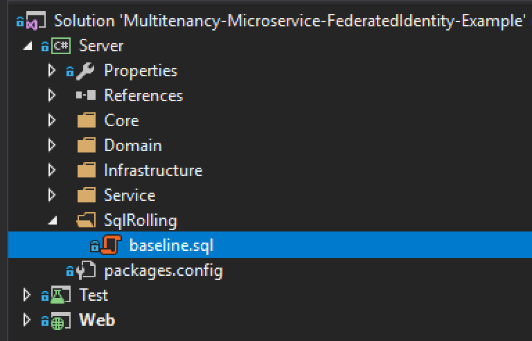
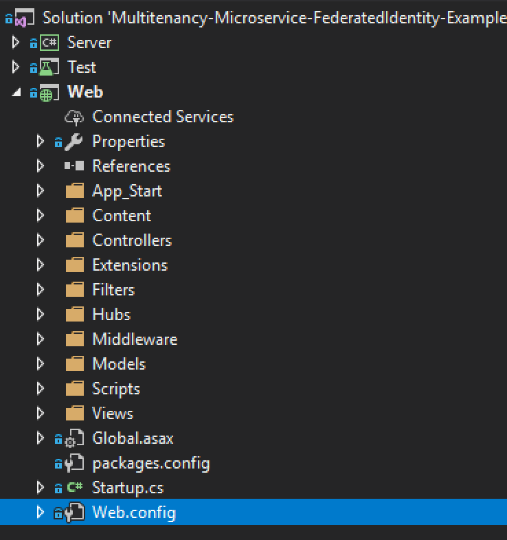
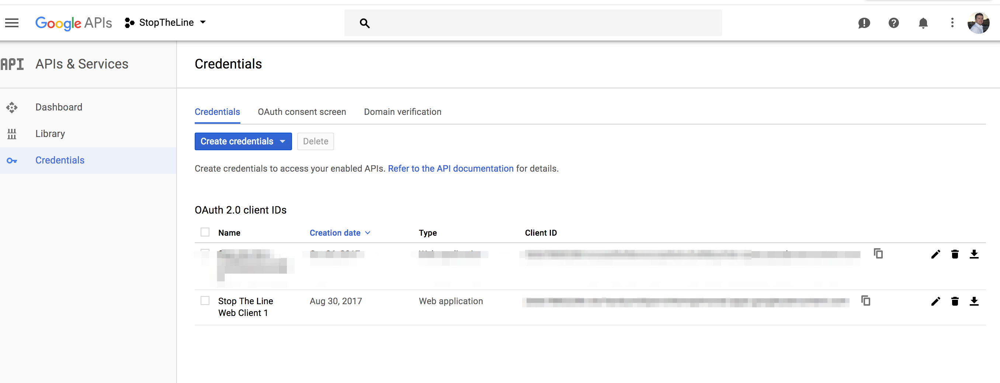
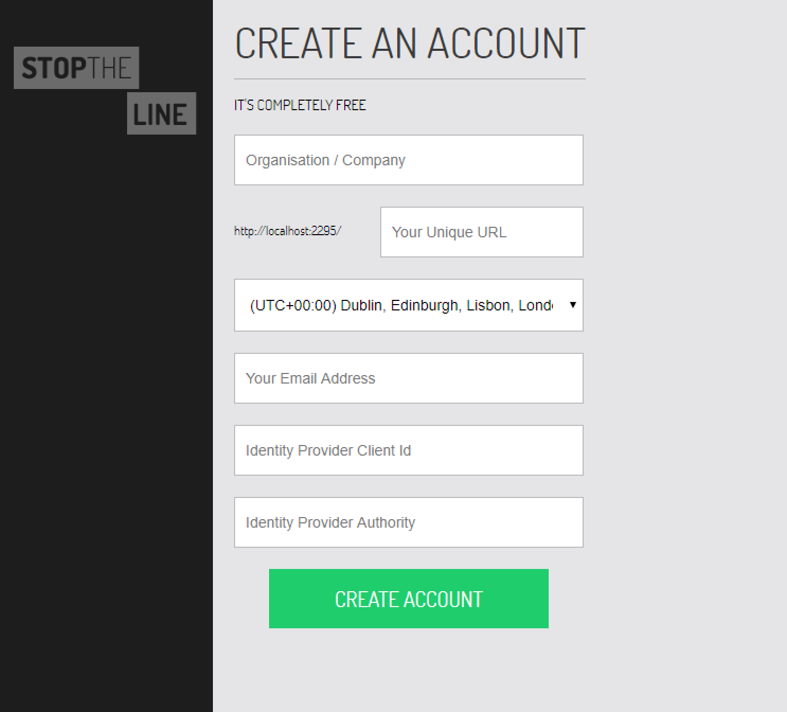
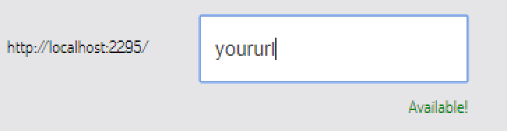
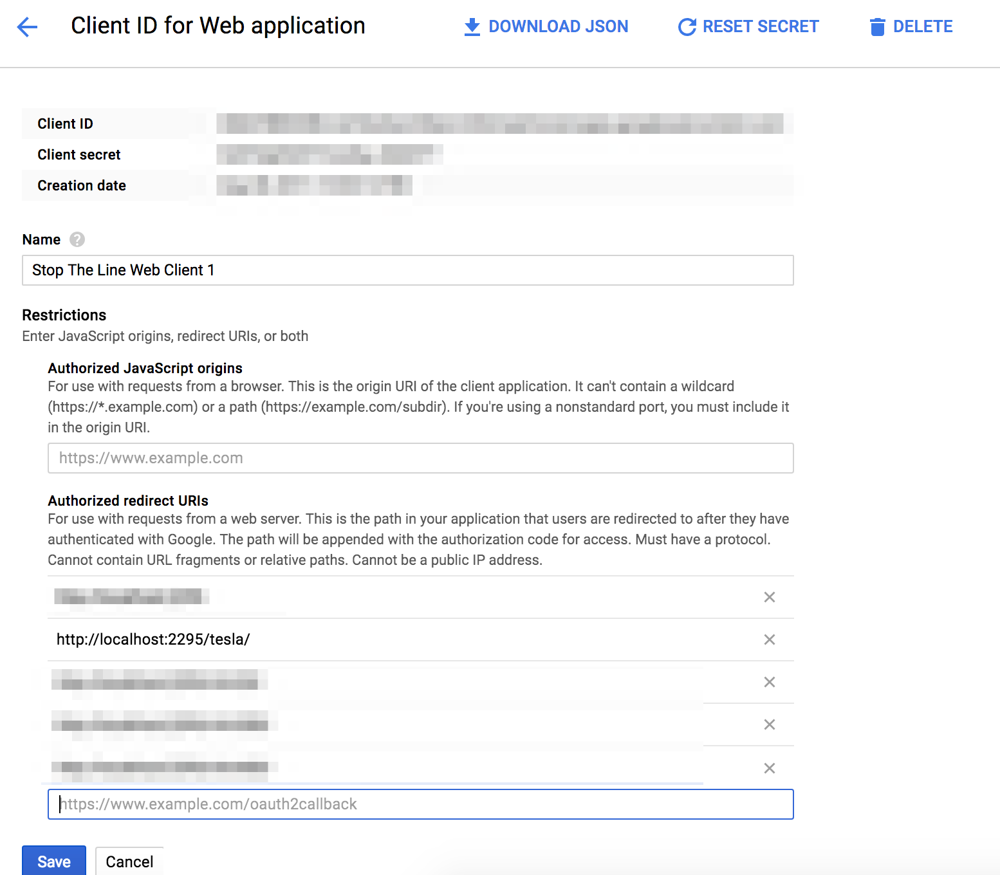
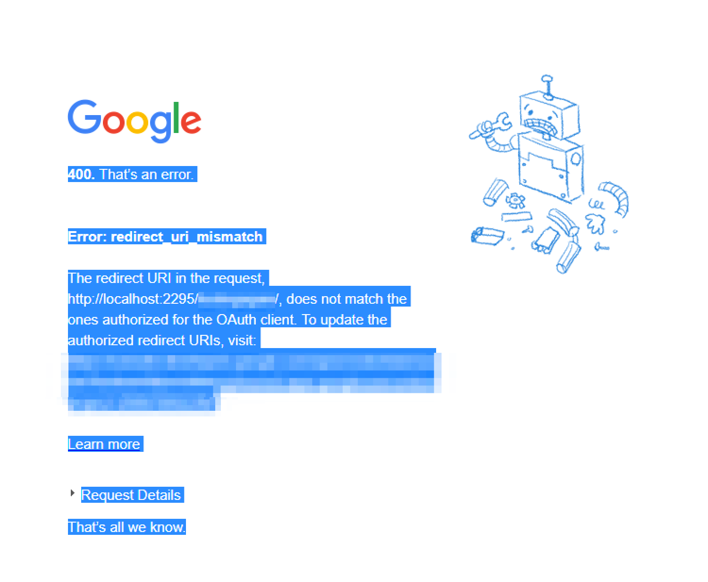
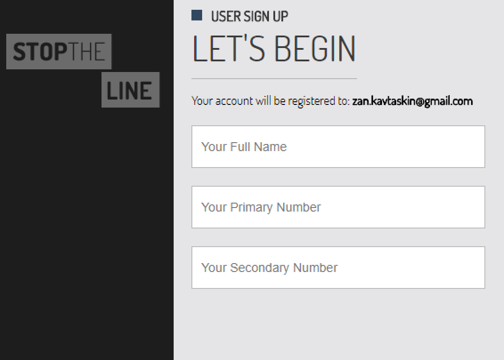

# Multitenancy and Federated Identity example (work in progress)

**Repository objective:** 
To supplement blog articles on multitenancy, microservices and federated identity (see below), and to create easy to follow code repository that makes sense (if it still makes no sense then please do let me know). 

Please do note that this repository currently does not contain microservice examples just yet, right now it covers multitenancy and federated identity. Please use this for theoretical / educational purposes only. 

## Articles 

[ASP.NET MVC Multitenancy, Part 0 - Subdomain VS URL Path](http://www.zankavtaskin.com/2018/05/aspnet-mvc-multitenancy-part-0.html)

[ASP.NET MVC Multitenancy, Part 1 - Routing with OWIN](http://www.zankavtaskin.com/2017/08/aspnet-mvc-multitenant-routing-with-owin.html)

[ASP.NET MVC Multitenancy, Part 2 - OpenID Connect authentication](http://www.zankavtaskin.com/2017/11/aspnet-mvc-multitenancy-part-2-openid.html)

[ASP.NET MVC Multitenancy, Part 3 - NHibernate Tenant Data Filtering and Shared Database](http://www.zankavtaskin.com/2017/12/aspnet-mvc-multitenancy-nhinbernate-shared-database-tenant-data-filtering.html)

ASP.NET MVC Multitenancy, Part 4 - Authorisation

[Basic SaaS conversion guide, migrate your application to the Azure Cloud]( http://www.zankavtaskin.com/2016/12/basic-saas-conversion-guide-migrate.html)

## Setup Instructions

### Step 1 - Create SQL Server 

### Step 2 - Run baseline.sql

This will create stoptheline database in your SQL server. 

### Step 3 - Update Web.config connection string

### Step 4 - Run the web project 

### Step 5 - Create authentication keys

To use this project you will need authenticate using Open ID Connect protocol. To do this you can use Google, Azure AD, etc. 

I am going to use Google to keep things simple, you will need to setup Auth 2.0 credentials, [this Google page explains how you can do this](https://developers.google.com/identity/protocols/OpenIDConnect). 

Once you are done you should see something like this:

### Step 6 - Go to http://localhost:2295/signup/tenant/

Fill everything in use the client id that Google has given you when you have created your auth 2.0 credentials. For authority just use https://accounts.google.com

Before you press "create account", please whitelist your URL, how do you know what your URL is? You get a preview:

Now that you know what it is go to your Google web application credential account and add your URL to the "Authorized redirect URIs":

Press "create account".

If you don't do this, when you will press "create account" you will get a screen that will look like this:

### Step 7 - Sign Up

### Step 8 - You are in, just use the app